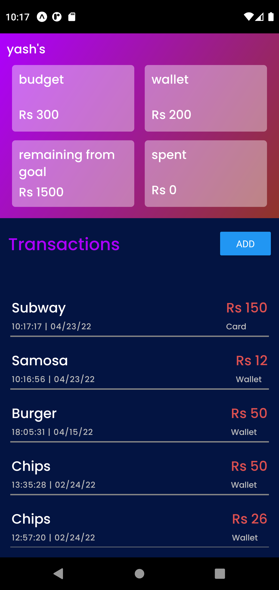
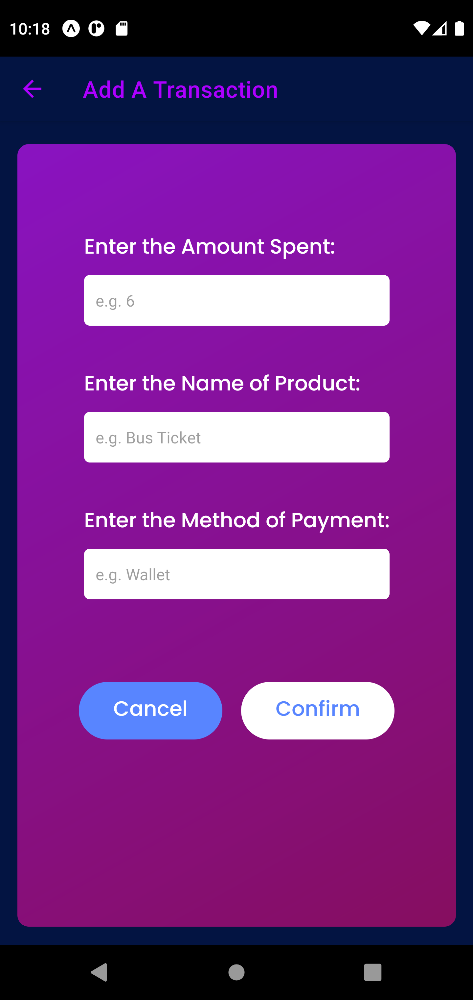
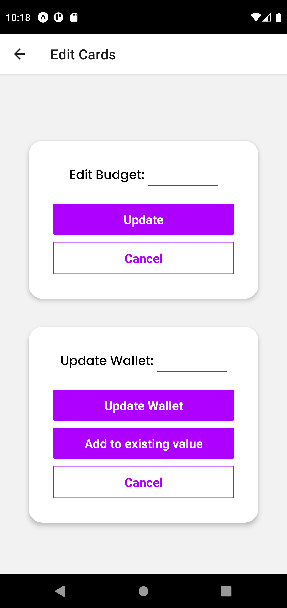
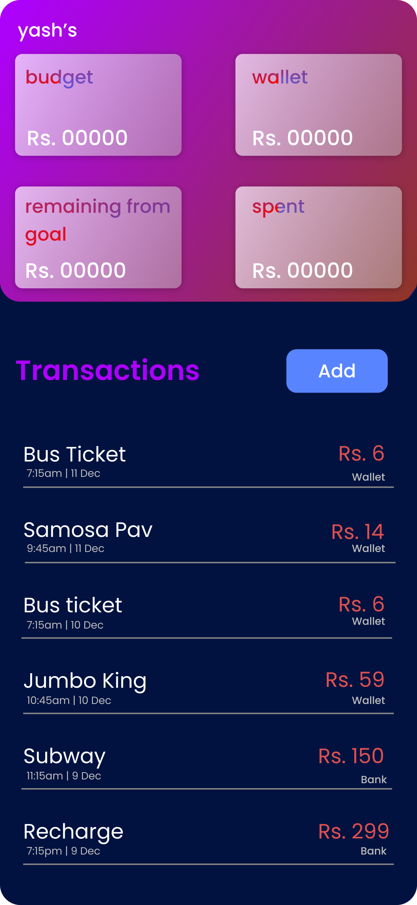
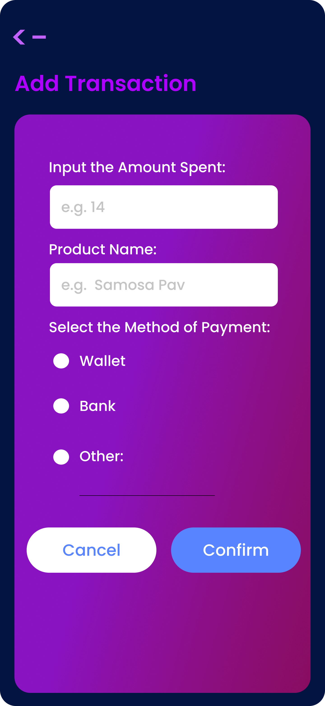

# xpenditure

- Uses React-Native and FireBase (Cloud FireStore) as backend
- Used Expo CLI
- User can add transactions done in daily life
- Easy to use
- Monitor expenses
- Set Budget
(more features to be added)

##### App Screenshots:

##### Design Templates:
- These are the designs I made in Figma for the app.

